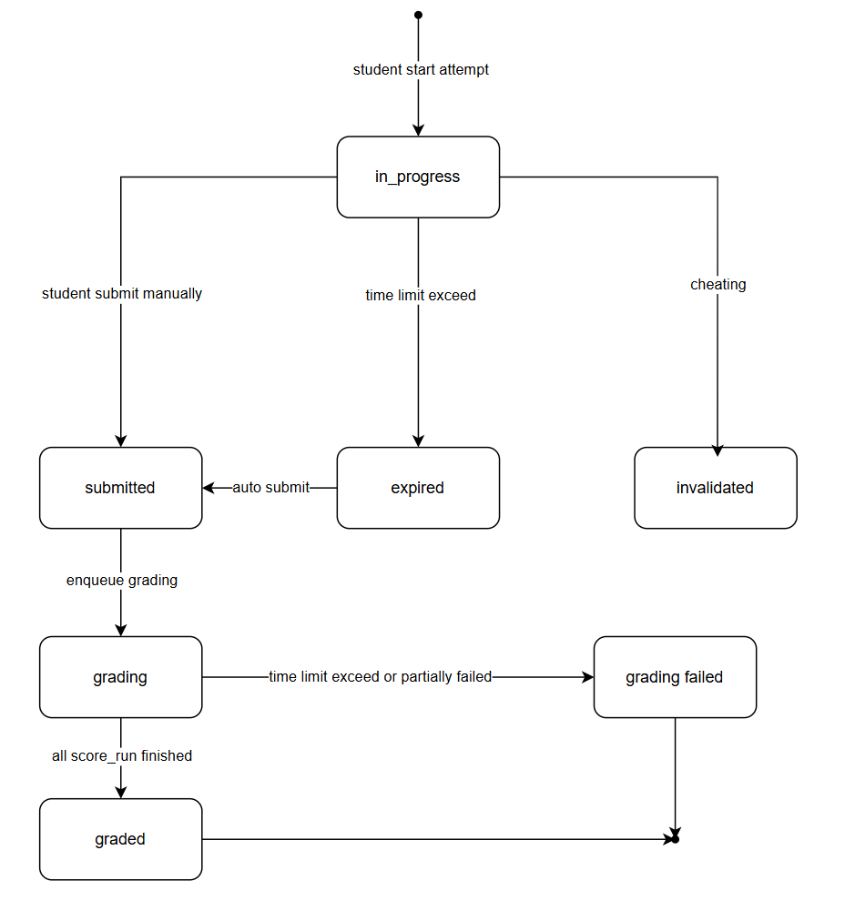
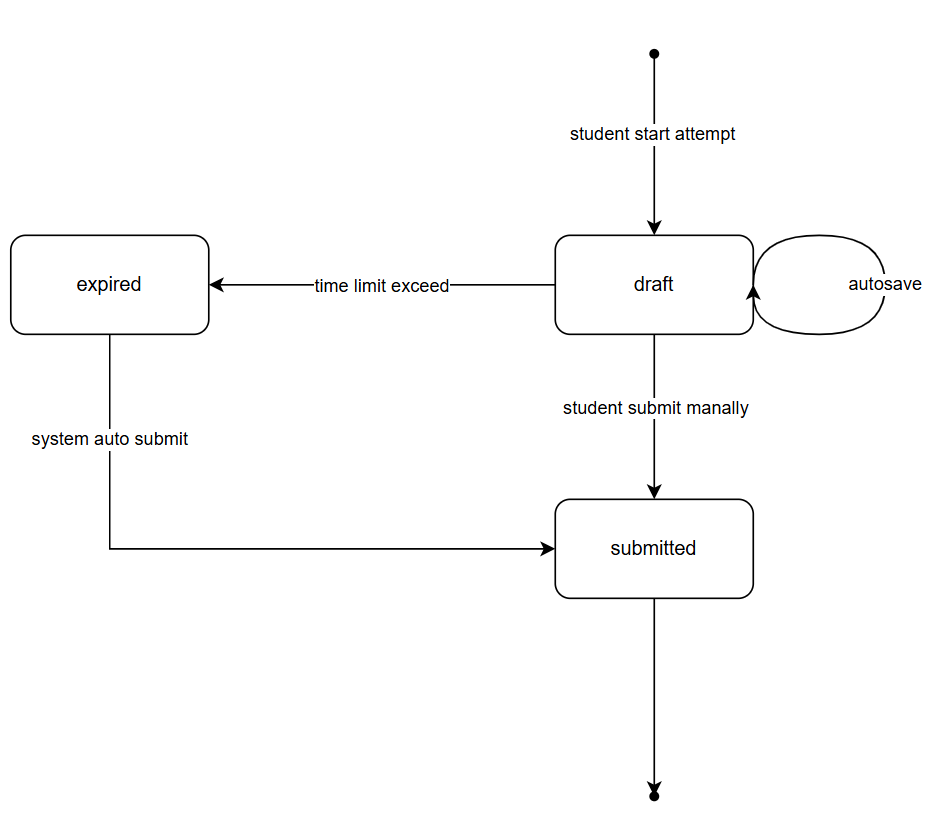
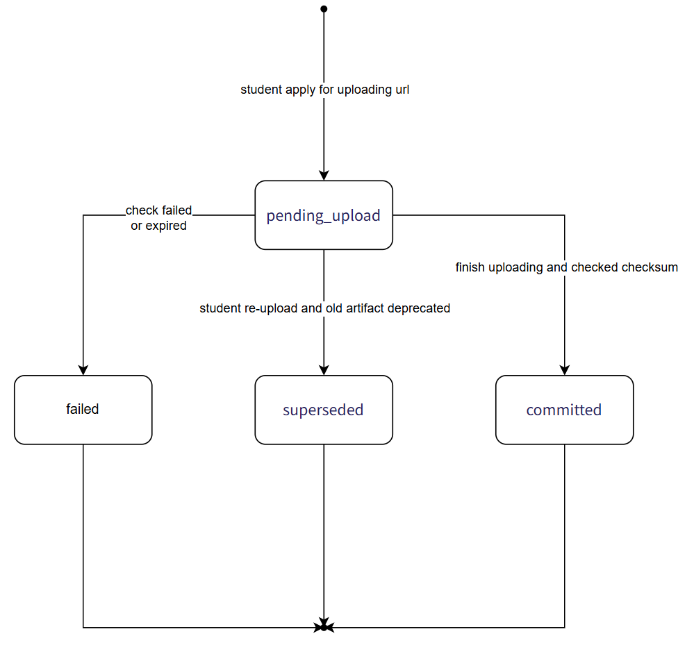
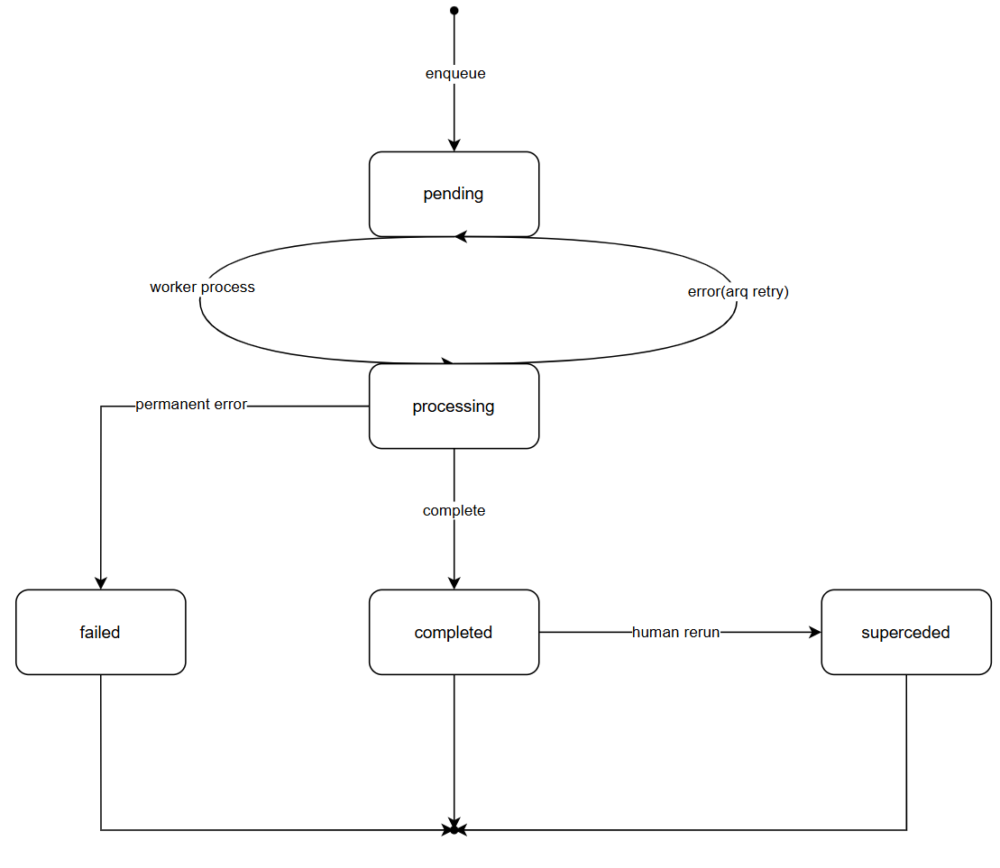
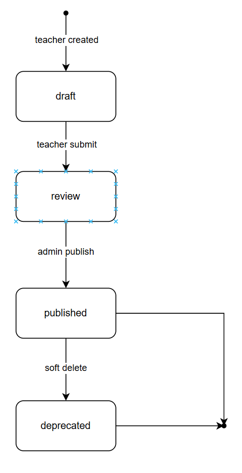
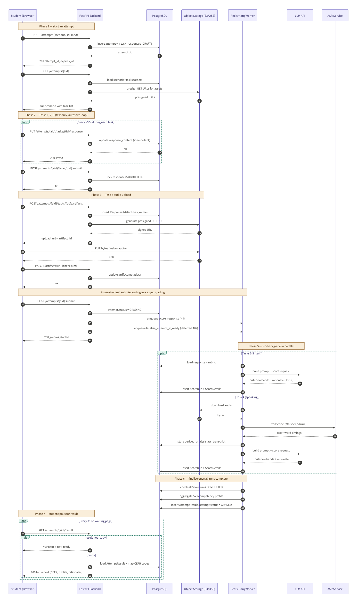

## 实体

### 核心能力实体

- Social-interpersonal等评分领域 domain/aspect
- Linguistic等评分能力 competence
- cfer语言评分等级 level
- 矩阵单元格 competence matrix

### 评分标准实体

- 评分体系 rubric
- 评分细则 rubric_criterion
- 评分描述（字段包含中文描述、英文描述）rubric_band_descriptor

### 场景实体

- 场景 scenario
- 场景任务 task
- 材料（资源） material
- 任务对应材料的关联表 task_material
- 任务对应rubric的关联表 task_rubric

### 考试会话实体

- 单次考试尝试 attempt
- 单次尝试单个任务的作答（响应） task_response
- 单个作答产生的文件 response_artifact

### 评分结果实体

- 单个评分（使用rater type区分人工和AI）
- 单个评分中，对应单个评分标准criterion的细节
- 最终评分结果

### 角色权限控制系统实体

- 用户
- 学生
- 老师

### 反馈模块实体

- 反馈
- 作弊检测记录

## 实体属性

### 核心能力实体

- Social-interpersonal等评分领域 domain/aspect
  - 编码
  - 名字
  - 描述
  - 是否启用
- Linguistic等评分能力 competence
  - 编码
  - 名字
  - 描述
  - 是否启用
- cefr语言评分等级 level
  - 名字
  - 描述
  - 是否启用
  - 顺序
- competence matrix 矩阵单元格
  - domain
  - competence
  - cefr
  - description
  - 是否启用
  - 版本
  - 来源（自订还是全球标准）

### 评分标准实体

- 评分体系 rubric
  - 编码 {ScenarioName_TaskNumber_TaskName}
  - name
  - version
  - status
- 评分细则 rubric_criterion
  - rubric_id
  - 编码
  - title
  - description_i18n(jsonb)
  - domain_id
  - competence_id
- rubric_band_descriptor 评分描述（字段包含中文描述、英文描述）
  - rubric_creteria_id
  - 等级band（1-4）
  - description_ai
  - description_human
  - cefr_level_id

### 场景实体

- 场景 scenario
  - 编码 code
  - 语言 lang
  - status
  - description_i18n(jsonb)
  - cefr_target_level
  - version
- 场景任务 task
  - scenario_id
  - sequence
  - description_i18n(jsonb)
  - time_limit(milliseconds)
  - task_type(number)
  - instruction_i18n(jsonb)
  - input_payload(jsonb)
  - response_schema(jsonb)
  - config(jsonb)
  - version(替换 material 时，task 也要跟着升版本)
- 材料（资源） material
  - name
  - material_type(including prompt)
  - mime_type
  - storage_key
  - duration_ms
  - transcript
  - metadata
  - version(upload again)
  - task_id
- 提示词模板 prompt_template
  - 编码
  - version
  - template_type
  - target_task_type(scoring | followup_question | feedback_generation)
  - target_language(reading | writing)
  - system_prompt
  - user_prompt(involving variable)
  - variables
  - output_schema
  - recommended_model
  - recommended_temperature
  - description_i18n(jsonb)
  - status
  - created_by(user id)
  - published_at
  - deprecated_at
- 任务对应rubric的关联表 task_rubric
  - tid
  - rubric_id
  - weight
    note:
- 教师替换 material → 创建一条新 material 记录（同 code、version+1）
- 想用新 material → 创建新 task version，关联到新 material_id
- 老的 attempt 引用的 task_version 还指向老 task → 老 task 还指向老 material → 历史完全可追溯
- material 的 storage_key、size_bytes、checksum、duration_ms 是 immutable——一旦 published，永远不能改
  name、description、metadata 是 mutable——可以原地改

### 考试会话实体

- 单次考试尝试 attempt
  - user_id
  - scenario_id
  - scenario_version
  - mode(pratice|formal)
  - started_at
  - submitted_at
  - expired_at
  - status
  - client_metadata(jsonb)
    - browser
    - network
    - device
- 单次尝试单个任务的作答（响应） task_response
  - aid
  - tid
  - task_version
  - started_at
  - submitted_at
  - expired_at
  - response_payload
  - derived_analysis(asr_metadata 是其中一种情况)
  - status(enum nubmer)
- 单个作答产生的文件 response_artifact
  - response_id
  - artifact_type
  - storage_key
  - mime_type
  - size_bytes(check for student account storage)
  - checksum
  - duration(budget management)
  - committed_at

### 评分结果实体

- 单个评分 score_run（使用rater type区分人工和AI，粒度是 task 级别）
  - response_id
  - rubric_id
  - rubric_version
  - status
  - overall_cefr_level
  - overall_band
  - prompt_template_id
  - model_name
  - model_temperature
  - model_metadata
  - model_response
  - rater_type
  - rater_id
  - completed_at
- 单个评分中，对应单个评分标准criterion的细节 score_detail
  - score_run_id
  - criterion_id
  - band(1-4)
  - completed_at
  - status
  - mapped_cefr_level
- 最终评分结果 attempt_result
  - aid
  - score_run_id
  - overall_cefr_level
  - overall_band
  - pass_fail
  - competence_profile(jsonb)
  - generated_at
    note: overall_cefr_level, overall_band 出现两次，表示初步结果和最终发布结果（人工矫正）

## 其他机制

### 评分重试机制

等待并完成

- 成功路径
  所有 task 都成功
- 超时兜底
  保证不会无限等待，从提交 attempt 开始评分起，超时十分钟则放弃，并且全部使用人工重评
- 瞬时失败
  - 网络抖动
  - Invalid API Key
  - Rate Limit
  - Service Unavailable
    使用 arq 的 retry 机制，重试大概率成功
- 重试次数
  累计检查 N 次还没成功就放弃
- 提前完成
  如果所有的评分 score run 都进入终态，completed 或者 failed，则不再等待，将 failed 的部分使用人工重评
- 网络兜底
  如果每个 score run 都完成，但是出现网络故障，导致无法 finalize attempt，则 finalise_attempt_if_ready 负责兜底

## API 设计

### 评分标准 rubric API(demo hardcode)

GET /api/v1/rubric-list
POST /api/v1/rubric/create
POST /api/v1/rubric/{id}/edit
GET /api/v1/rubric/{id}

### 评分标准细则 criterion API(demo hardcode)

POST /api/v1/rubric/criterion/create
POST /api/v1/rubric/criterion/{id}/edit

### 场景实体 scenario API(demo hardcode)

GET /api/v1/scenario-list
POST /api/v1/scanario/create
POST /api/v1/scenario/{id}/edit
GET /api/v1/scenario/{id}

### 场景任务实体 task API(demo hardcode)

GET /api/v1/task-list
POST /api/v1/task/create
POST /api/v1/task/{id}/edit
GET /api/v1/task/{id}

### 材料 material API(demo hardcode)

GET /api/v1/material-list
POST /api/v1/material/create
POST /api/v1/material/{id}/edit
GET /api/v1/material/{id}

### 考试流程 API

- 学生获取可选的场景
  GET /api/v1/available-scenario-list
- 学生开始作答
  POST /api/v1/attempt/start
- 学生查看未提交的 attempt
  GET /api/v1/attempt/active
- 学生恢复未完成的 attempt
  GET /api/v1/attempts/{aid}/resume
- 学生获取作答细节
  GET /api/v1/attempt/{aid}/task/{tid}
- 自动保存学生中间回答
  POST /api/v1/attempt/{aid}/task/{tid}/response/save
- 学生上传文件
  POST /api/v1/attempt/{aid}/task/{tid}/artifact/upload
- 学生修改文件
  POST /api/v1/artifact/{aid}/update
- 学生提交单个 task
  POST /api/v1/attempt/{aid}/task/{tid}/response/submit
- 学生提交整个 attempt
  POST /api/v1/attempt/{aid}/response/submit
- 学生查看结果
  GET /api/v1/attempt/{aid}/result

### 评分 score_run API

GET /api/v1/score-run-list

- 触发评分
  POST /api/v1/score-run/submit
- 人工评分员获取待评价任务
  GET /api/v1/rater/human/attempt-list
- 人工评分员获取作答和 rubric
  GET /api/v1/rater/human/attempt/{aid}
- 人工评分员提交评分
  POST /api/v1/rater/human/attempt/{aid}/submit
- 人工评分员获取评分
  GET /api/v1/rater/human/attempt/{aid}/score
- 人工评分员获取结果
  GET /api/v1/rater/human/attempt/{aid}/result
- 人工评分员获取学生的历史记录
  GET /api/v1/student/{sid}/history
- 人工评分员获取学生的competence
  GET /api/v1/student/{sid}/competency-profile

## 页面总体设计

### 老师端（demo hardcode）

- rubric 页面
  - 查看 rubric
  - 创建 rubric
    - 添加关联的 criterion
    - 添加 criterion 的 band
  - 编辑 rubric
    - 添加关联的 rubric
    - 添加 rubric 的 band
- criterion 页面
  - 查看 criterion
  - 创建 criterion
  - 编辑 criterion
- 人工评分页面
  - attempt 列表
  - attempt 细节 + task 对应的 rubric
  - attempt 校验
    - AI 评分细节
- scenario 页面
  - 查看 scenario
  - 编辑 scenario
    - metadata
    - 任务列表

### 学生端

- dashboard
  - 历史 attempt
- scenario 列表
  - 练习|正式模式切换
  - 只包含 scenario 4
- preflight 页面
  - 设备检测
  - 协议同意
- scenario 任务页面
- 并行的多个 task N 页面
- 提交确认页面（检查清单 + 确认按钮）
- scenario 侧栏（进度+倒计时）
- 提交后等待评分的页面(hardcode)
- result 报告页
  - cefr
  - domain * competence
- attempt 历史页面
- competence 矩阵浏览
- profile 个人中心

## scenario page detail design

### 学生端

#### scenario list page

- API
  GET /api/v1/available-scenario-list
- layout
  - 一张卡片一个 scenario
    每个 scenario 显示目标 cefr 等级，耗费时长等 metadata

#### scenario runner page

- layout
  - 左侧是 task 的进度条，显示标题和状态，当前任务高亮，已完成的打勾，未完成的显示灰色
  - 顶部是 scenario name + 当前 task + 倒计时（practice 模式显示为0）
  - 主内容区根据 task type 显示不同的组件
  - 底部操作栏左侧是上一题，右侧是提交本任务按钮，提交后出现确认弹窗
  - task1 阅读 + 笔记
    - 左半屏是 BrightWave 公司广告全文，可滚动
    - 右半屏是笔记区，上面是 "3-5 个 qualities"输入区，下面"3 个 responsibilities"输入区
  - task2 写求职信
    - 左半屏是只读的"参考资料"标签——Tab 1 是 Task 1 的笔记，Tab 2 是 Job Ad 全文（可滚动）
    - 右半屏是富文本编辑器，支持段落/换行，下面有字数统计
  - task3 听讲座 + 笔记
    - 上半屏是音频播放器，不允许暂停/拉进度/速度切换，允许 1 次完整重听
    - 下半屏是笔记区，vision 输入区，additional qualities 输入区
  - task4 面试录音
    - 上半屏显示当前问题（4 个问题串行）
    - 中间一个录音组件：大圆形录音按钮、波形可视化、当前录音时长、最大 3 分钟提示。
    - 下半屏左侧显示"参考你的笔记"面板
- detail
  - autosave
    每30秒触发一次 /attempts/{aid}/tasks/{tid}/response 自动保存
  - 倒计时到 0 自动提交当前 task 并跳下一个

#### submit confirm 页面

- layout
  - finished task list
  - task detail
  - confirm button
- API
  GET /attempts/{aid}/summary
  POST /attempts/{id}/submit

#### result waiting 页面

- layout
  Task 1 笔记       ✓ 已评分
  Task 2 求职信     ⟳ 评分中（LLM 调用）
  Task 3 听力笔记   ⟳ 排队中
  Task 4 面试       ⟳ 转写中（ASR 处理）
- API
  GET /attempts/{aid}/result 返回 409 则刷新进度条，返回 200 则跳到 Result 页。

#### result 页面

- layout
  - cefr level
  - domain * competence
  - task
    - overall_band
    - criterion_band
    - rationale(AI)
- API
  GET /attempts/{id}/result

### state machine

- attempt
  
- task response
  
- response artifact
  
- score run
  
- scenario/task/rubric/prompt_template(demo hardcode)
  

### system interaction

- 主体：
  student - s
  fastapi backend - be
  postgresql - pq
  object storage - s3
  redis + arq worker - q
  llm api - llm
  asr service - asr
- 流程：

  - 阶段1 start attempt
    - s -> be: POST  attempt/start
    - be -> pq: insert attempt + 4 reponse
    - pq -> be: attempt_id
    - be -> student: attempt_id + expired_at
    - student -> be: GET attempt/{aid}
    - be -> pq: load scenario + task + material
    - pq -> s3: presigned URL for materials
    - s3 -> be: presigned URLs
    - be -> s: full scenario + task list
  - phase2: text task(1 2 3) autosave(loop)
    - s -> be: POST /attempt/{aid}/task/{tid}/response
    - be -> pq: update response
    - pq -> be: return ok
    - be -> s: auto save
    - s -> be: POST /attempt/{aid}/task/{tid}/submit
    - be -> pq: transform response status
    - be -> s: return ok
  - phase3: task4 audio upload
    - s -> be: POST /attempt/{aid}/task/{tid}/artifact/upload
    - be -> pq: generate key + insert response artifact
    - be -> s3: generate presigned PUT URL
    - s3 -> be: signed URL
    - be -> s: upload_url + artifact_id
    - s -> s3: PUT bytes(webm audio)
    - s3 -> s: return 200
    - s -> be: POST /artifact/{aid}/update
    - be -> pq: update artifact metadata
    - be -> s: return 200
  - phase 4:
    - s -> be: POST attempt/{aid}/submit
    - be -> pq: transform attempt.status
    - pq -> q: enqueue socre_response * N
    - pq -> q: enqueue finalise_attempt_if_ready
    - be -> s: return 200; grading started
  - phase 5: grading parallel
    - task 1|2|3
      - q -> pq: load response + rubric
      - q -> llm: build prompt + request score
      - llm -> q: criterion band + model_response
      - q -> pq: insert score_run + score_detail
    - task 4
      - q -> s3: download request
      - s3 -> q: audio file
      - q -> asr: request audio to text
      - asr -> q: text + word timing
      - q -> pq: store task_response.derived_analysis
      - q -> llm: build prompt + request score
      - llm -> q: criterion band + model_response
      - q -> pq: insert score_run + score_detail
    - phase 6: finalise attempt
      - q -> pq: check all score_run completed/failed
      - q -> pq: aggregate competence profile
      - q -> pq: insert attempt_result, transform attempt status
    - phase 7: student poll for result
      - s -> be: GET /attempt/{aid}/result
      - alt: result not ready
        - be -> s: result not ready
      - else
        - be -> pq: load attempt_result
        - be -> s: full report(attempt_result, overall_cefr_level)
